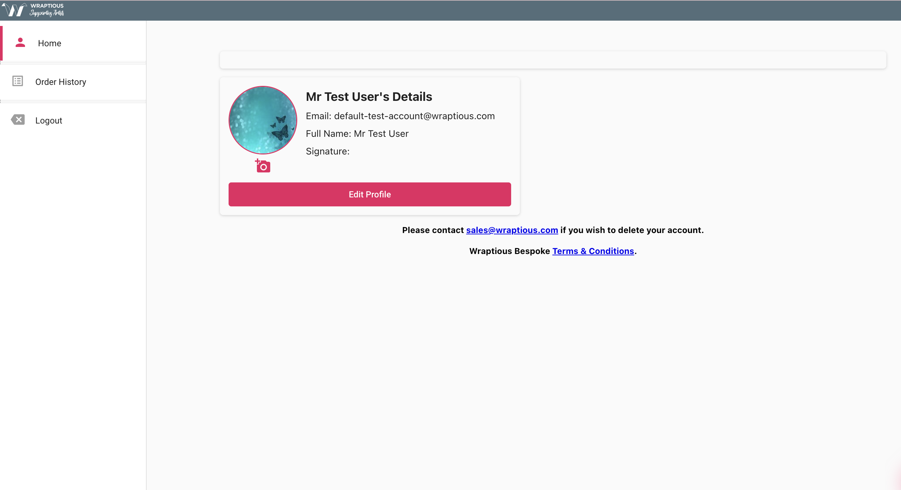
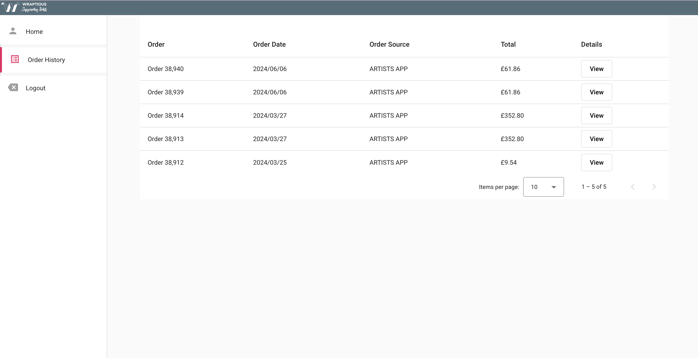

# Wraptious Take Home Assignment

Welcome to the wraptious Angular 17 take-home project assignment. This guide will provide you with the instructions needed to complete the project.
You are required to complete a simple Angular application with two main pages: a Dashboard page and an Order History page. 
Please follow the guidelines and the screenshot provided to achieve the expected view. The application is written using reactive paradigms and Angular Material Components.
[Visit the dev version of the app to get some inspiration](https://artists-dev.wraptious.com)
- Test user account
```
{
  username : default-test-account@wraptious.com,
  password : &testAcc2021
}
 ```
## setup
- Make sure the Node version installed is between 18.13.0 to 21.1.0 on your machine.
- Clone the repository from `https://github.com/wraptious/ng-artists-assignment.git`, navigate to root of project and run `npm install` to install the dependencies.
- Run `npm start` to start the application. Visit `http://localhost:4200` to view the application.

1. ## Login Functionality
- Collect the form values and pass to the login function.
- The rest of the functionality is already implemented. 
- Study the code and understand how the login functionality works. This will  help understand the next tasks and how to complete them.

2. ## Dashboard view
- Dashboard Component - Introduce the top bar and side-navigation views.  create a card to display the current logged-in user details and styled as in the screenshot below. Use the local image `src/assets/img/assignment/SampleAvatarImage.jpg` as your avatar.
- Ignore the empty card above the user card in the screenshot.
- Consume the user data from the `authStatus$` BehaviourSubject in the `AuthService` service as an observable like so `this.authStatus$.asObservable()` .
- 

3. ## Order History view
- Order History Component - display current logged-in user with oder history is a data table like in the screenshot below.
- Navigate to oder-history component using the user's id. ie `this.router.navigate(['/order-history', user.id])`
- Fix the styling for the component.
- Consume the user data from the `authStatus$` BehaviourSubject in the `AuthService` service as an observable like so `this.authStatus$.asObservable()` .
- 
